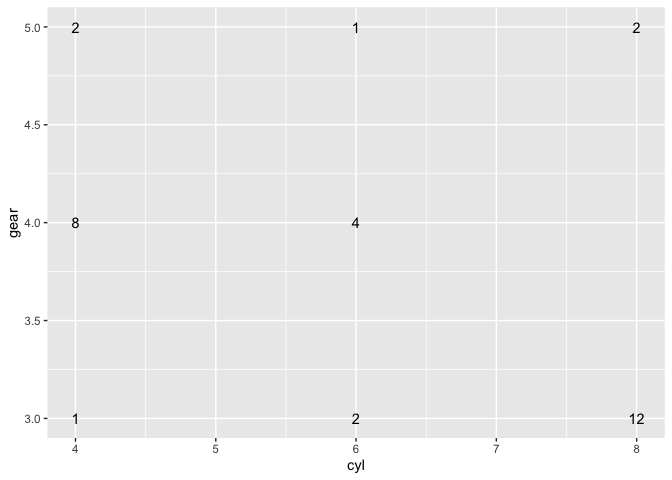
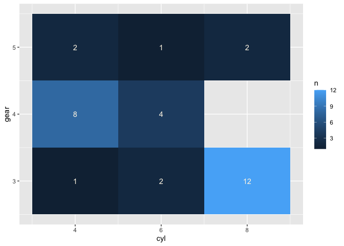
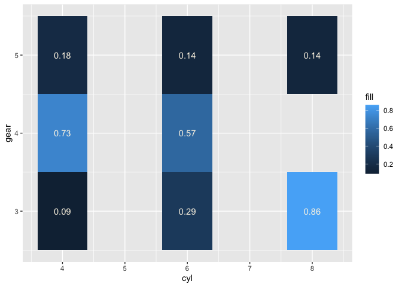

<!-- README.md is generated from README.Rmd. Please edit that file -->

# ggpivot

<!-- badges: start -->
<!-- badges: end -->

The goal of ggpivot is to make tables w ggplot2.

Specify x and y categorical variables; let ggplot2 count number of
observations or calculate proportions.

## Installation

And the development version from [GitHub](https://github.com/) with:

``` r
# install.packages("devtools")
devtools::install_github("EvaMaeRey/ggpivot")
```

``` r
library(tidyverse)
#> ── Attaching packages ─────────────────────────────────────── tidyverse 1.3.0 ──
#> ✓ ggplot2 3.3.5     ✓ purrr   0.3.4
#> ✓ tibble  3.1.6     ✓ dplyr   1.0.8
#> ✓ tidyr   1.0.2     ✓ stringr 1.4.0
#> ✓ readr   1.3.1     ✓ forcats 0.5.0
#> Warning: package 'ggplot2' was built under R version 3.6.2
#> Warning: package 'tibble' was built under R version 3.6.2
#> Warning: package 'purrr' was built under R version 3.6.2
#> Warning: package 'dplyr' was built under R version 3.6.2
#> ── Conflicts ────────────────────────────────────────── tidyverse_conflicts() ──
#> x dplyr::filter() masks stats::filter()
#> x dplyr::lag()    masks stats::lag()
library(magrittr)
#> Warning: package 'magrittr' was built under R version 3.6.2
#> 
#> Attaching package: 'magrittr'
#> The following object is masked from 'package:purrr':
#> 
#>     set_names
#> The following object is masked from 'package:tidyr':
#> 
#>     extract
```

# a geom that counts categories and prints the count

``` r
geom_text_twowaycount_script <- readLines("./R/geom_text_twowaycount.R")
```

``` r

#' Title
#'
#' @param data
#' @param scales
#'
#' @return
#' @export
#'
#' @examples
#' # step 1b test the computation function
#' library(dplyr)
#' mtcars %>%
#'   # input must have required aesthetic inputs as columns
#'   rename(x = cyl, y = gear) %>%
#'   compute_group_twowaycount() %>%
#'   head()
compute_group_twowaycount <- function(data, scales){

  data %>%
    # add an additional column called label
    # the geom we inherit from requires the label aesthetic
    dplyr::count(x, y) %>%
    dplyr::rename(label = n)

}


StatTwowaycount <- ggplot2::ggproto(`_class` = "Twowaycount",
                                  `_inherit` = ggplot2::Stat,
                                  required_aes = c("x", "y"),
                                  compute_group = compute_group_twowaycount)

#' Title
#'
#' @param mapping
#' @param data
#' @param position
#' @param na.rm
#' @param show.legend
#' @param inherit.aes
#' @param ...
#'
#' @return
#' @export
#'
#' @examples
#' library(ggplot2)
#' ggplot(data = mtcars) +
#' aes(x = cyl, y = gear) +
#' geom_text_twowaycount()
geom_text_twowaycount <- function(mapping = NULL, data = NULL,
                                  position = "identity", na.rm = FALSE,
                                  show.legend = NA,
                                  inherit.aes = TRUE, ...) {
  ggplot2::layer(
    stat = StatTwowaycount, # proto object from Step 2
    geom = ggplot2::GeomText, # inherit other behavior
    data = data,
    mapping = mapping,
    position = position,
    show.legend = show.legend,
    inherit.aes = inherit.aes,
    params = list(na.rm = na.rm, ...)
  )
}
```

``` r
library(ggplot2)
ggplot(data = mtcars) +
aes(x = cyl, y = gear) +
geom_text_twowaycount()
```



# a geom that is a tile and fills (color) according to count

``` r
geom_tile_twowaycount_script <- readLines("./R/geom_tile_twowaycount.R")
```

``` r

#' Title
#'
#' @param data
#' @param scales
#'
#' @return
#' @export
#'
#' @examples
#' # step 1b test the computation function
#' library(dplyr)
#' library(magrittr)
#' mtcars %>%
#'   # input must have required aesthetic inputs as columns
#'   rename(x = cyl, y = gear) %>%
#'   compute_group_twowaycountfill() %>%
#'   head()
compute_group_twowaycountfill <- function(data, scales){

  data %>%
    # add an additional column called label
    # the geom we inherit from requires the label aesthetic
    dplyr::count(x, y) %>%
    dplyr::rename(fill = n)

}


StatTwowaycountfill <- ggplot2::ggproto(`_class` = "Twowaycount",
                                  `_inherit` = ggplot2::Stat,
                                  required_aes = c("x", "y", "fill"),
                                  compute_group = compute_group_twowaycountfill)

#' Title
#'
#' @param mapping
#' @param data
#' @param position
#' @param na.rm
#' @param show.legend
#' @param inherit.aes
#' @param ...
#'
#' @return
#' @export
#'
#' @examples
#' library(ggplot2)
#' ggplot(data = mtcars) +
#' aes(x = cyl, y = gear) +
#' geom_tile_twowaycount() +
#' aes(fill = 1) +
#' geom_text_twowaycount()
geom_tile_twowaycount <- function(mapping = NULL, data = NULL,
                                  position = "identity", na.rm = FALSE,
                                  show.legend = NA,
                                  inherit.aes = TRUE, ...) {
  ggplot2::layer(
    stat = StatTwowaycountfill, # proto object from Step 2
    geom = ggplot2::GeomTile, # inherit other behavior
    data = data,
    mapping = mapping,
    position = position,
    show.legend = show.legend,
    inherit.aes = inherit.aes,
    params = list(na.rm = na.rm, ...)
  )
}
```

``` r
library(ggplot2)
ggplot(data = mtcars) +
aes(x = cyl, y = gear) +
geom_tile_twowaycount() +
  aes(fill = 1) + 
geom_text_twowaycount(color = "oldlace")
```



# a geom that is a tile and fills (color) according to proportion within column (x)

``` r
geom_tile_prop_within_x_script <- readLines("./R/geom_tile_prop_within_x.R")
```

``` r
compute_panel_prop_within_x <- function(data, scales) {

  data %>%
    group_by(x, y) %>%
    summarise(fill = sum(fill)) %>%
    mutate(fill = fill/sum(fill)) %>%
    ungroup()

}

StatPropwithinx <- ggplot2::ggproto("StatPropovertime",
                                     Stat,
                                     compute_panel = compute_panel_prop_within_x,
                                     required_aes = c("x", "y", "fill")
)

#' Title
#'
#' @param mapping
#' @param data
#' @param position
#' @param na.rm
#' @param show.legend
#' @param inherit.aes
#' @param ...
#'
#' @return
#' @export
#'
#' @examples
#' library(ggplot2)
#' ggplot(data = mtcars) +
#' aes(x = cyl, y = gear) +
#' geom_tile_prop_within_x() +
#' aes(fill = 1) +
#' geom_text_twowaycount(color = "oldlace")
geom_tile_prop_within_x <- function(mapping = NULL,
                                     data = NULL,
                                     position = "identity",
                                     na.rm = FALSE,
                                     show.legend = NA,
                                     inherit.aes = TRUE, ...) {
  layer(
    stat = StatPropwithinx, geom = ggplot2::GeomTile, data = data, mapping = mapping,
    position = position, show.legend = show.legend, inherit.aes = inherit.aes,
    params = list(na.rm = na.rm, ...)
  )
}
```

``` r
geom_text_prop_within_x_script <- readLines("./R/geom_text_prop_within_x.R")
```

``` r
compute_panel_prop_within_x_text <- function(data, scales) {

  data %>%
    group_by(x, y) %>%
    summarise(label = sum(fill)) %>%
    mutate(label = label/sum(label)) %>%
    mutate(label = round(label, 2)) %>%
    ungroup()

}

StatPropwithinxtext <- ggplot2::ggproto("StatPropwithinxtext",
                                     Stat,
                                     compute_panel = compute_panel_prop_within_x_text,
                                     required_aes = c("x", "y", "fill")
)

#' Title
#'
#' @param mapping
#' @param data
#' @param position
#' @param na.rm
#' @param show.legend
#' @param inherit.aes
#' @param ...
#'
#' @return
#' @export
#'
#' @examples
#' library(ggplot2)
#' ggplot(data = mtcars) +
#' aes(x = cyl, y = gear) +
#' geom_tile_prop_within_x() +
#' aes(fill = 1) +
#' geom_text_prop_within_x(color = "oldlace")
geom_text_prop_within_x <- function(mapping = NULL, data = NULL,
                                    position = "identity", na.rm = FALSE,
                                    show.legend = NA,
                                    inherit.aes = TRUE, ...) {
  ggplot2::layer(
    stat = StatPropwithinxtext, # proto object from Step 2
    geom = ggplot2::GeomText, # inherit other behavior
    data = data,
    mapping = mapping,
    position = position,
    show.legend = show.legend,
    inherit.aes = inherit.aes,
    params = list(na.rm = na.rm, ...)
  )
}
```

``` r
library(ggplot2)
ggplot(data = mtcars) +
aes(x = cyl, y = gear) +
geom_tile_prop_within_x(width = .8) +
geom_text_prop_within_x(color = "oldlace") +
  aes(fill = 1)
#> `summarise()` has grouped output by 'x'. You can override using the `.groups`
#> argument.
#> `summarise()` has grouped output by 'x'. You can override using the `.groups`
#> argument.
```


